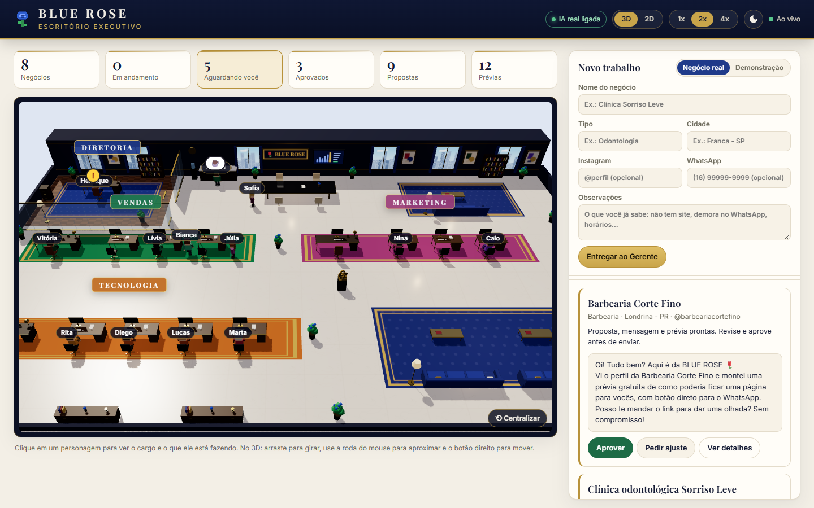
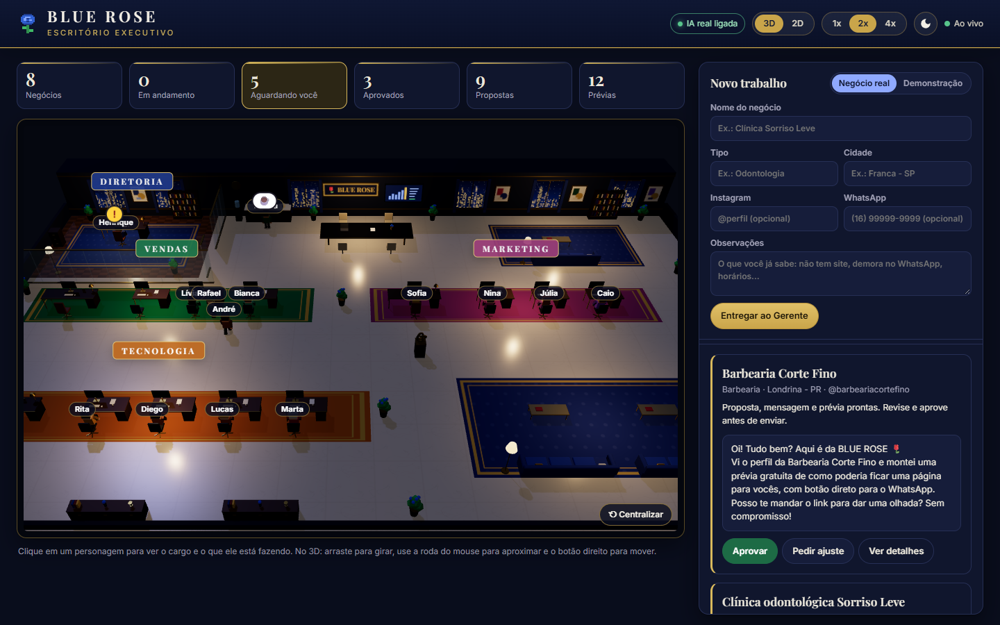
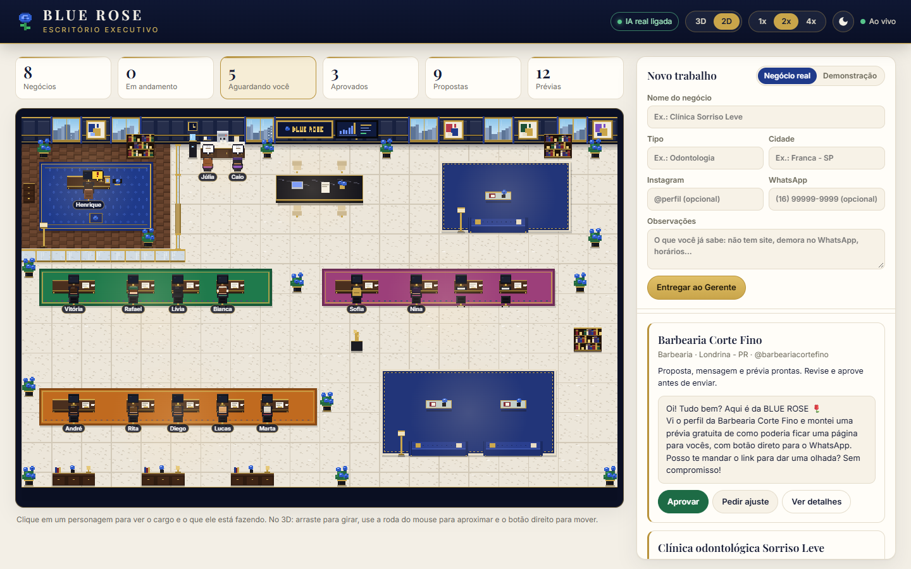

<div align="center">


# Escritório BLUE ROSE

**Um escritório virtual em 3D (e em pixel art) onde 14 agentes de IA trabalham de verdade.**

Um time completo de especialistas em IA (diretoria, vendas, marketing e tecnologia) analisa
negócios locais, cria identidade visual, posts, anúncio, proposta, landing page e robô de
WhatsApp, revisa tudo e para esperando a **sua aprovação**. Nenhum agente envia nada para ninguém.


-c9a54a)




</div>

## Sobre o projeto

A [BLUE ROSE](https://cauacaetano.github.io/blue-rose-automacao-express/) faz sites e
automação de atendimento no WhatsApp para clínicas, consultórios e negócios locais. Este projeto
transforma o processo comercial da empresa em um escritório que dá para **ver trabalhando**:
cada agente é um personagem que anda pelo corredor, senta na mesa, digita (o monitor acende),
lê e entrega envelopes para o colega da próxima etapa.

**Destaques**

- 🏢 **Escritório em 3D (Three.js):** gire, aproxime e arraste a câmera; dia e noite com a cidade
  acesa nas janelas. Também há uma visão 2D em pixel art, e as duas mostram o mesmo escritório.
- 🤖 **IA real com plano B:** os agentes usam a API do Claude. Sem chave, sem créditos ou com a
  API fora do ar, o erro aparece no log e o escritório continua funcionando no modo simulado.
- ⚡ **Backend no controle:** o servidor decide tudo (filas, caminhos, estados) e envia eventos por
  WebSocket. O navegador só desenha.
- 💾 **Nada se perde:** tudo fica no SQLite local (inclusive a fila de cada agente) e, se você
  quiser, é espelhado no **Supabase**. Se o servidor reiniciar, o trabalho continua de onde parou.
- 🔒 **Humano no comando:** tudo para em "aguardando aprovação". A mensagem aprovada é exportada
  por você (copiar ou abrir o WhatsApp com o texto pronto) e o envio é sempre manual.
- 🪟 **Aplicativo para Windows:** instalador com atalho na área de trabalho, sem precisar de Node.

## O time (14 agentes)

| Departamento | Agente | O que faz |
|---|---|---|
| Diretoria | **Henrique · CEO** ★ | Recebe os pedidos, distribui, confere o pacote final e escreve o resumo para você aprovar ("!" dourado quando há algo esperando você). |
| Vendas | **Vitória · Head de Vendas** ★ | Define a abordagem comercial e passa o negócio ao SDR. |
| Vendas | **Rafael · SDR** | Analisa o negócio cadastrado e recomenda o serviço ideal (sem raspagem de sites). |
| Vendas | **Lívia · Closer** | Escreve a proposta com os preços reais e a mensagem de primeiro contato. |
| Vendas | **Bianca · Customer Success** | Prepara respostas prontas sobre preço, prazo, mensalidade e funcionamento. |
| Marketing | **Sofia · Head de Marketing** ★ | Define a mensagem da marca do cliente e coordena o time. |
| Marketing | **Nina · Designer de Marca** | Cria a identidade visual da prévia: paleta, fontes e estilo. |
| Marketing | **Júlia · Estrategista de Conteúdo** | Escreve a bio do Instagram e ideias de posts. |
| Marketing | **Caio · Gestor de Tráfego** | Monta um anúncio local (Meta/Google) com público e orçamento sugeridos. |
| Tecnologia | **André · CTO** ★ | Planeja a página e a automação de cada negócio. |
| Tecnologia | **Rita · Dev SEO** | Define título, descrição e palavras-chave para aparecer no Google. |
| Tecnologia | **Diego · Dev Front-end** | Gera a prévia da landing page em HTML com a identidade e o SEO do time. |
| Tecnologia | **Lucas · Dev de Automação** | Monta o roteiro do robô de WhatsApp: boas-vindas, menu e respostas. |
| Tecnologia | **Marta · QA** | Confere texto, links e versão mobile; pode devolver para o Diego. |

```mermaid
flowchart LR
    V([Você]) -->|cadastra negócio| CEO[Henrique<br>CEO]
    CEO --> HV[Vitória<br>Head de Vendas] --> SDR[Rafael<br>SDR]
    SDR --> HM[Sofia<br>Head de Marketing] --> NI[Nina<br>Identidade] --> JU[Júlia<br>Conteúdo] --> CA[Caio<br>Anúncio]
    CA --> LI[Lívia<br>Proposta]
    LI --> CTO[André<br>CTO] --> RI[Rita<br>SEO] --> DI[Diego<br>Prévia] --> LU[Lucas<br>Robô WhatsApp] --> MA[Marta<br>QA]
    MA -->|achou erro| DI
    MA --> BI[Bianca<br>Respostas] --> CEO2[Henrique<br>confere tudo]
    CEO2 --> Q{Aguardando<br>você}
    Q -->|Aprovar| E[Exportar mensagem<br>copiar / WhatsApp]
    Q -->|Pedir ajuste| LI
```



## Prints

| 3D à noite | Visão 2D em pixel art |
|---|---|
|  |  |

## Como rodar

**Requisitos:** [Node.js](https://nodejs.org) 22.13 ou mais novo.

```bash
git clone <url-deste-repositório>
cd escritorio-blue-rose
npm install
cp .env.example .env      # no Windows: copy .env.example .env
npm start
```

Abra <http://localhost:3000>. Sem chave da API, tudo funciona no **modo simulado**.

### Aplicativo para Windows

Também dá para usar como um programa comum, com janela própria e sem terminal:

```bash
npm run app      # abre o aplicativo a partir do código
npm run dist     # gera o instalador e a versão portátil em dist/
```

- `Escritorio-BLUE-ROSE-Instalador-x.y.z.exe`: instala e cria atalhos no menu Iniciar e na área de trabalho.
- `Escritorio-BLUE-ROSE-x.y.z-portatil.exe`: roda direto, sem instalar.

No aplicativo, as configurações (`.env`), o banco e as prévias ficam em
`%APPDATA%\Escritório BLUE ROSE`, **fora do executável**. Assim o `.exe` pode ser compartilhado
sem levar a sua chave. Use o menu **Escritório → Configurar chave da API** para editar o `.env`.

### Ligando a IA real

1. Crie uma conta em <https://console.anthropic.com>, adicione créditos em **Billing** e, se quiser,
   defina um limite mensal em **Limits**.
2. Em **API Keys**, crie uma chave e cole no `.env`, em `ANTHROPIC_API_KEY=`.
3. Reinicie o servidor. O topo do painel mostra **"IA real ligada"**.

| Variável | Padrão | Para que serve |
|---|---|---|
| `ANTHROPIC_API_KEY` | vazio | Chave da API. Vazia = modo simulado. |
| `MODELO_IA` | `claude-opus-5-5` | Modelo usado pelos agentes. `claude-sonnet-5-5` custa cerca de metade. |
| `ESFORCO_IA` | `medium` | Quanto o modelo raciocina: `low`, `medium` ou `high`. |
| `SITE_URL` | site da BLUE ROSE | Link usado nas propostas e mensagens. |
| `PORT` / `HOST` | `3000` / `127.0.0.1` | Endereço do servidor. Use `HOST=0.0.0.0` para abrir no celular pela rede Wi-Fi. |

> **Custo aproximado:** com o modelo padrão, cada negócio completo usa 11 chamadas à IA
> (cerca de 45 mil tokens), algo em torno de US$ 0,50.

### Espelho no Supabase (opcional)

O escritório grava tudo no SQLite local e pode **espelhar automaticamente no Supabase** (Postgres
na nuvem), útil para backup, para ver os dados de outro lugar ou para montar painéis.

1. Crie um projeto em <https://supabase.com> (o plano grátis serve).
2. No **SQL Editor**, rode o arquivo [`supabase/schema.sql`](supabase/schema.sql). Ele cria as
   tabelas com **RLS ligado e sem acesso público**.
3. Em **Project Settings → API**, copie a **Project URL** e a chave **service_role** para o `.env`:
   `SUPABASE_URL=` e `SUPABASE_SERVICE_ROLE_KEY=`. Essa chave é secreta e fica só no servidor.
4. Reinicie. O topo do painel mostra **☁ Supabase**, e cada negócio é enviado poucos segundos
   depois de qualquer mudança. Se a nuvem falhar, o aviso aparece no log e nada trava.

## Como usar

1. **Negócio real:** preencha nome, tipo, cidade, Instagram, WhatsApp e observações e clique em
   *Entregar ao Gerente* (o CEO Henrique). Para só ver o escritório funcionando, use **Demonstração**, que cria
   negócios fictícios.
2. Acompanhe os agentes no escritório (**3D** ou **2D**, no topo). Clique em um personagem para ver
   o cargo e o que ele está fazendo; no 3D, a câmera desliza até ele. Use **1x / 2x / 4x** para acelerar.
3. Em **Aguardando você**, leia o resumo do Gerente e a mensagem. Em *Ver detalhes* há a proposta,
   a prévia (visão de celular ou computador), o **Marketing** (paleta de cores, posts e anúncio), a
   **Tecnologia** (SEO e robô de WhatsApp), as respostas prontas e o histórico.
4. Clique em **Aprovar** ou **Pedir ajuste** (o ajuste volta para a Lívia com o seu comentário).
5. Depois de aprovar, a aba **✉ Enviar** permite editar a mensagem e **copiar** ou
   **abrir o WhatsApp** com o texto pronto. Quem envia é você.

As prévias em HTML ficam salvas na pasta `previas/`.

## Arquitetura

```
Navegador (3D Three.js ou 2D)  ◄── WebSocket (eventos) ───  Servidor Node.js
        │                                                     ├─ Escritório (orquestra)
        └──── REST (/api: cadastrar, aprovar, ajuste) ──────► ├─ 14 agentes, cada um com sua fila
                                                              ├─ Serviços: Claude API → plano B simulado
                                                              ├─ SQLite (tudo persistido)
                                                              └─ Supabase (espelho opcional na nuvem)
```

- Cada agente tem **sua própria fila** (tabela `tarefas`) e trabalha **uma tarefa por vez**.
- Entregas entre agentes são tarefas também: o agente anda até a mesa do colega, mostra o envelope
  e só então a tarefa entra na fila do outro, em uma transação no banco.
- As respostas da IA usam **structured outputs** (JSON validado por schema). Cada especialista tem
  instruções próprias em [`server/ia/prompts.js`](server/ia/prompts.js), com os serviços e preços reais.
- O relógio da simulação ([`server/relogio.js`](server/relogio.js)) permite 1x/2x/4x sem
  dessincronizar as animações.

```
server/
  index.js          Express + API REST + WebSocket
  escritorio.js     Orquestra agentes, eventos e ações do usuário
  agentes/          Classe base, Gerente, time e fluxo de trabalho
  ia/               Cliente da API do Claude e instruções de cada especialista
  servicos/         Chama a IA e, se falhar, usa o modo simulado
  simulado/         Dados inventados para o modo simulado
  db.js             SQLite: negócios, propostas, prévias, decisões, histórico e filas
  whatsapp.js       Monta links com o texto pronto (nunca envia)
  supabase.js       Espelho opcional no Supabase
shared/layout.js    Planta do escritório (usada pelo servidor e pelas visões 2D e 3D)
public/js/cena3d.js Escritório 3D (Three.js): móveis, personagens, luzes e câmera
public/js/cena.js   Escritório 2D em pixel art
supabase/schema.sql Tabelas do Supabase (com RLS)
electron/           Aplicativo de desktop para Windows
test/               Testes automáticos (node --test)
```

## Testes

```bash
npm test
```

Os testes rodam o fluxo completo com o relógio acelerado, em banco de memória, e **nunca chamam a
API real**. Eles também rodam no GitHub Actions a cada push.

## Segurança e regras

- Nenhum agente envia mensagem, e-mail ou qualquer coisa para pessoas reais.
- O SDR não faz raspagem de sites: analisa só o que você cadastrou.
- A chave `service_role` do Supabase fica só no servidor; as tabelas têm RLS sem acesso público.
- Chaves ficam apenas no `.env`, que está no `.gitignore` (assim como o banco e as prévias).
- As prévias geradas pela IA são exibidas isoladas (sandbox + Content-Security-Policy, sem scripts).
- O painel não tem login: mantenha `HOST=127.0.0.1` ou use só em rede de confiança.

## Licença

[MIT](LICENSE). Feito com 🌹 pela BLUE ROSE.
