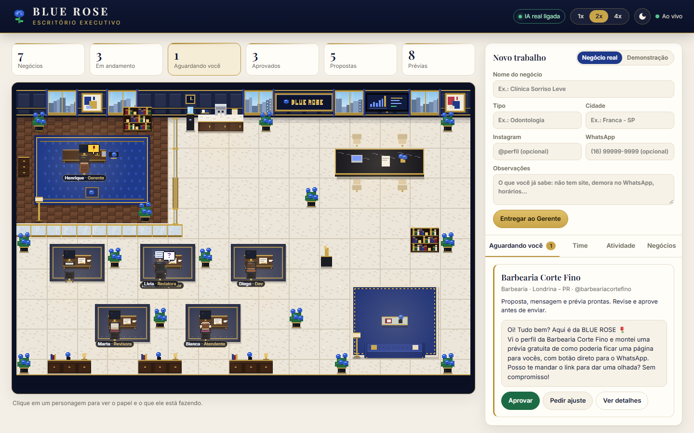
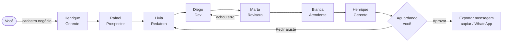
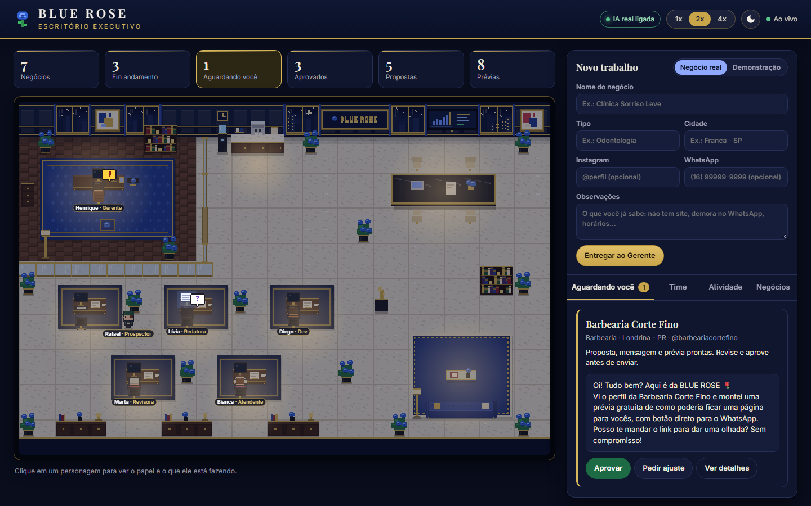
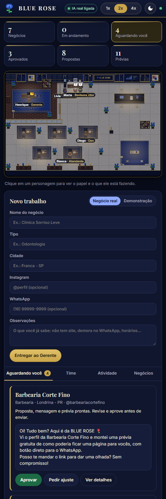

<div align="center">


# Escritório BLUE ROSE

**Um escritório virtual em pixel art onde agentes de IA trabalham de verdade.**

Seis especialistas em IA prospectam negócios locais, escrevem propostas, montam prévias de
landing pages e revisam tudo. Depois, param e esperam a **sua aprovação**. Nenhum agente
envia nada para ninguém.


-c9a54a)




</div>

## Sobre o projeto

A [BLUE ROSE](https://cauacaetano.github.io/blue-rose-automacao-express/) faz sites e
automação de atendimento no WhatsApp para clínicas, consultórios e negócios locais. Este projeto
transforma o processo comercial da empresa em um escritório que dá para **ver trabalhando**:
cada agente é um personagem que anda pelo corredor, senta na mesa, digita (o monitor acende),
lê e entrega envelopes para o colega da próxima etapa.

**Destaques**

- 🤖 **IA real com plano B:** os agentes usam a API do Claude. Sem chave, sem créditos ou com a
  API fora do ar, o erro aparece no log e o escritório continua funcionando no modo simulado.
- 🎨 **Pixel art feita 100% em código:** nenhuma imagem externa. São tiles de 16px desenhados
  em canvas e ampliados sem suavização, com tema claro (dia) e escuro (noite, com a cidade acesa).
- ⚡ **Backend no controle:** o servidor decide tudo (filas, caminhos, estados) e envia eventos por
  WebSocket. O navegador só desenha.
- 💾 **Nada se perde:** negócios, propostas, prévias, decisões, histórico e as filas de cada agente
  ficam no SQLite. Se o servidor reiniciar, o trabalho continua de onde parou.
- 🔒 **Humano no comando:** tudo para em "aguardando aprovação". A mensagem aprovada é exportada
  por você (copiar ou abrir o WhatsApp com o texto pronto) e o envio é sempre manual.
- 📱 **Responsivo:** funciona no computador e no celular.

## O time

| | Agente | Especialidade | O que faz |
|---|---|---|---|
| 👔 | **Henrique · Gerente** | Gerente de Operações | Recebe os pedidos, confere o pacote final e escreve o resumo para aprovação. Mostra um **"!"** dourado quando há algo esperando você. |
| 🔎 | **Rafael · Prospector** | Analista de Prospecção Local | Analisa o negócio cadastrado e recomenda o serviço ideal (sem raspagem de sites). |
| ✍️ | **Lívia · Redatora** | Redatora de Vendas | Escreve a proposta com os preços reais e a mensagem de primeiro contato. |
| 💻 | **Diego · Dev** | Desenvolvedor Front-end | Gera a prévia da landing page em HTML, pensada primeiro para o celular. |
| 🧐 | **Marta · Revisora** | Revisora de Qualidade | Confere texto, links e versão mobile (IA + verificações automáticas); pode devolver para o Dev. |
| 💬 | **Bianca · Atendente** | Especialista em Atendimento | Prepara respostas prontas sobre preço, prazo, mensalidade e funcionamento. |



## Prints

| Noite (tema escuro) | Celular |
|---|---|
|  |  |

## Como rodar

**Requisitos:** [Node.js](https://nodejs.org) 22.13 ou mais novo.

```bash
git clone <url-deste-repositório>
cd escritorio-blue-rose
npm install
cp .env.example .env      # no Windows: copy .env.example .env
npm start
```

Abra <http://localhost:3000>. Sem chave da API, tudo funciona no **modo simulado**.

### Aplicativo para Windows

Também dá para usar como um programa comum, com janela própria e sem terminal:

```bash
npm run app      # abre o aplicativo a partir do código
npm run dist     # gera o instalador e a versão portátil em dist/
```

- `Escritorio-BLUE-ROSE-Instalador-x.y.z.exe`: instala e cria atalhos no menu Iniciar e na área de trabalho.
- `Escritorio-BLUE-ROSE-x.y.z-portatil.exe`: roda direto, sem instalar.

No aplicativo, as configurações (`.env`), o banco e as prévias ficam em
`%APPDATA%\Escritório BLUE ROSE`, **fora do executável**. Assim o `.exe` pode ser compartilhado
sem levar a sua chave. Use o menu **Escritório → Configurar chave da API** para editar o `.env`.

### Ligando a IA real

1. Crie uma conta em <https://console.anthropic.com>, adicione créditos em **Billing** e, se quiser,
   defina um limite mensal em **Limits**.
2. Em **API Keys**, crie uma chave e cole no `.env`, em `ANTHROPIC_API_KEY=`.
3. Reinicie o servidor. O topo do painel mostra **"IA real ligada"**.

| Variável | Padrão | Para que serve |
|---|---|---|
| `ANTHROPIC_API_KEY` | vazio | Chave da API. Vazia = modo simulado. |
| `MODELO_IA` | `claude-opus-5-5` | Modelo usado pelos agentes. `claude-sonnet-5-5` custa cerca de metade. |
| `ESFORCO_IA` | `medium` | Quanto o modelo raciocina: `low`, `medium` ou `high`. |
| `SITE_URL` | site da BLUE ROSE | Link usado nas propostas e mensagens. |
| `PORT` / `HOST` | `3000` / `127.0.0.1` | Endereço do servidor. Use `HOST=0.0.0.0` para abrir no celular pela rede Wi-Fi. |

> **Custo aproximado:** com o modelo padrão, cada negócio completo custa algo em torno de
> US$ 0,30 a 0,60.

## Como usar

1. **Negócio real:** preencha nome, tipo, cidade, Instagram, WhatsApp e observações e clique em
   *Entregar ao Gerente*. Para só ver o escritório funcionando, use **Demonstração**, que cria
   negócios fictícios.
2. Acompanhe os agentes no mapa. Clique em um personagem para ver o cargo e o que ele está fazendo.
   Use **1x / 2x / 4x** para acelerar.
3. Em **Aguardando você**, leia o resumo do Gerente e a mensagem. Em *Ver detalhes* há a proposta,
   a prévia (visão de celular ou computador), as respostas prontas e o histórico.
4. Clique em **Aprovar** ou **Pedir ajuste** (o ajuste volta para a Redatora com o seu comentário).
5. Depois de aprovar, a aba **✉ Enviar** permite editar a mensagem e **copiar** ou
   **abrir o WhatsApp** com o texto pronto. Quem envia é você.

As prévias em HTML ficam salvas na pasta `previas/`.

## Arquitetura

```
Navegador (canvas + painel)  ◄── WebSocket (eventos) ───  Servidor Node.js
        │                                                   ├─ Escritório (orquestra)
        └──── REST (/api: cadastrar, aprovar, ajuste) ────► ├─ 6 agentes, cada um com sua fila
                                                            ├─ Serviços: Claude API → plano B simulado
                                                            └─ SQLite (tudo persistido)
```

- Cada agente tem **sua própria fila** (tabela `tarefas`) e trabalha **uma tarefa por vez**.
- Entregas entre agentes são tarefas também: o agente anda até a mesa do colega, mostra o envelope
  e só então a tarefa entra na fila do outro, em uma transação no banco.
- As respostas da IA usam **structured outputs** (JSON validado por schema). Cada especialista tem
  instruções próprias em [`server/ia/prompts.js`](server/ia/prompts.js), com os serviços e preços reais.
- O relógio da simulação ([`server/relogio.js`](server/relogio.js)) permite 1x/2x/4x sem
  dessincronizar as animações.

```
server/
  index.js          Express + API REST + WebSocket
  escritorio.js     Orquestra agentes, eventos e ações do usuário
  agentes/          Classe base, Gerente, time e fluxo de trabalho
  ia/               Cliente da API do Claude e instruções de cada especialista
  servicos/         Chama a IA e, se falhar, usa o modo simulado
  simulado/         Dados inventados para o modo simulado
  db.js             SQLite: negócios, propostas, prévias, decisões, histórico e filas
  whatsapp.js       Monta links com o texto pronto (nunca envia)
shared/layout.js    Mapa do escritório (usado pelo servidor e pelo navegador)
public/             Front: canvas em pixel art + painel
test/               Testes automáticos (node --test)
```

## Testes

```bash
npm test
```

Os testes rodam o fluxo completo com o relógio acelerado, em banco de memória, e **nunca chamam a
API real**. Eles também rodam no GitHub Actions a cada push.

## Segurança e regras

- Nenhum agente envia mensagem, e-mail ou qualquer coisa para pessoas reais.
- O Prospector não faz raspagem de sites: analisa só o que você cadastrou.
- Chaves ficam apenas no `.env`, que está no `.gitignore` (assim como o banco e as prévias).
- As prévias geradas pela IA são exibidas isoladas (sandbox + Content-Security-Policy, sem scripts).
- O painel não tem login: mantenha `HOST=127.0.0.1` ou use só em rede de confiança.

## Licença

[MIT](LICENSE). Feito com 🌹 pela BLUE ROSE.
